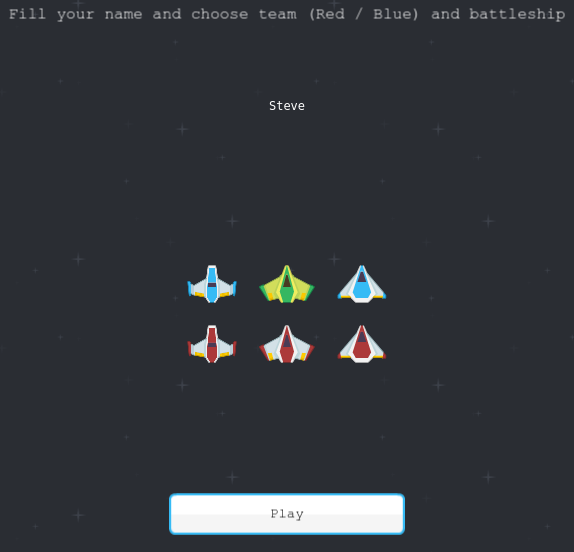
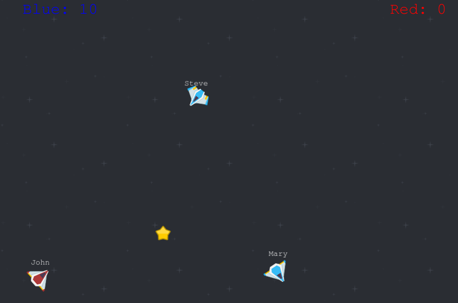

# Intro

Basic multiplayer Space Game built with [Phaser JS](https://phaser.io/), [Node JS](https://nodejs.org/es/), [Express](https://expressjs.com/es/) and [Socket.io](https://socket.io/).

Just pick a team (Red / Blue) and collect stars before your enemies. You can customize your nickname and your battleship. Using [Kenny Space Shooter Redux assets pack](https://kenney.nl/assets/space-shooter-redux). Use the arrow keys to move the spaceship.





# Installation

```
npm install
npm run start
```

# To Do
* Add collisions with asteroids.
* Spaceship can fire laser beams.
* Much bigger scenario with a camera and map to locate others

# License
Released under the [MIT License](http://www.opensource.org/licenses/mit-license.php).